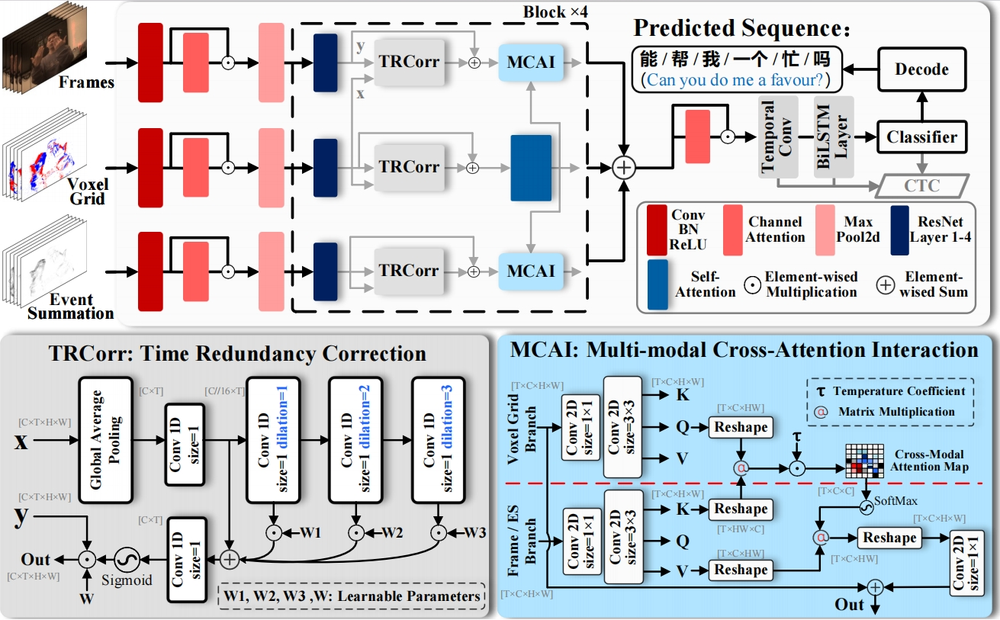
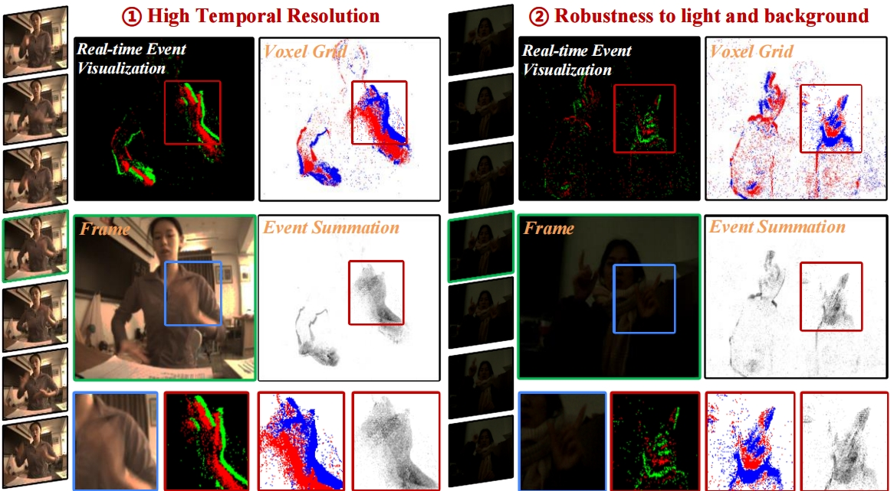
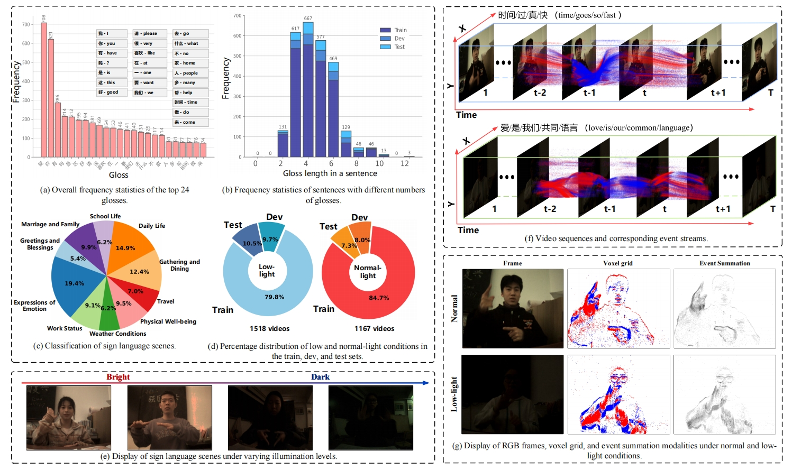

# EvCSLR
EvCSLR: Event-guided Continuous Sign Language  Recognition and Benchmark ([TMM2024]())




This repo is based on [VAC (ICCV 2021)](https://github.com/VIPL-SLP/VAC_CSLR) and [CorrNet (CVPR 2023)](https://github.com/hulianyuyy/CorrNet/). Many thanks for their great work!

# Requirements
- The packages in `requirements.txt` shiuld be installed.
-  Install the package ctcdecode==0.4 [[parlance/ctcdecode]](https://github.com/parlance/ctcdecode)，for beam search decode. (ctcdecode is only supported on the Linux platform.)

-  Use sclite [[kaldi-asr/kaldi]](https://github.com/kaldi-asr/kaldi) for evaluation. After installation, create a soft link toward the sclite: 
  `mkdir ./software`
  `ln -s PATH_TO_KALDI/tools/sctk-2.4.10/bin/sclite ./software/sclite`

# EvCSLR dataset
We provide the [[EvCSLR data]](https://pan.baidu.com/s/1JM_IwtiB7Obl7G18o3RnMQ?pwd=j6vb) that can be downloaded.




# Pretrained model
We provide the following pre-trained model trained on the EvCSLR dataset:
[checkpoint](https://pan.baidu.com/s/1C4wT7Rvz3Xzg6ro7wf5A7g?pwd=3x69)

We have released a stable model weight obtained through post-training from scratch. The inference results are slightly better than the metrics reported in the paper, as detailed in the table below.

|    EvCSLR dataset       | WER on Dev | WER on Test |                    
|:----------------------: | :--------: | :---------: | 
| Ours |    18.4    |    15.8     | 
| Update        |  18.2  |  15.2 |  


# Test
To test the performance of our framework, you can use the provided code.

Once you have configured the specific paths, you can run the following code. The pre-trained models should be downloaded and placed in the root dir, while the EvCSLR dataset, `EvCSLR_release\EvCSLR`, should be stored in the `data` directory. 

The dev and test results with their metrics will be saved in the `work_dir` directory.

Edit the configuration file in `configs\baseline.yaml`, and choose `phase: test`. Then, run the code `python main.py`, and you will obtain both dev and test results.

# Train 
If you wish to train on your own data, please read and execute the `main.py` script, and modify the corresponding parameter settings.

More detailed parameter configurations can be found in the `configs` file.

## Citation

If you find our work useful, please consider citing our paper:
```
@ARTICLE{EvCSLR@Jiang,
  author={Jiang, Yu and Wang, Yuehang and Li, Siqi and Zhang, Yongji and Guo, Qianren and Chu, Qi and Gao, Yue},
  journal={IEEE Transactions on Multimedia},
  title={EvCSLR: Event-guided Continuous Sign Language  Recognition and Benchmark},
  year={2024},
  volume={},
  number={},
  pages={1-12},
  doi={}
}
```
